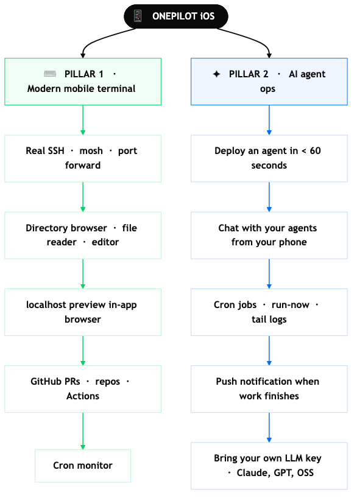
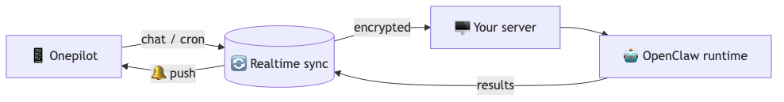
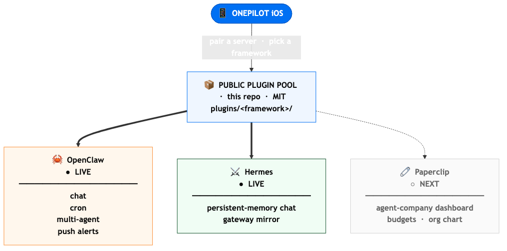

<div align="center">


### The mobile terminal for modern developers — with an AI agent layer built in.

[**Download on onepilotapp.com →**](https://onepilotapp.com)

[](https://onepilotapp.com)
[](https://onepilotapp.com)
[](./LICENSE)
[](#supported-frameworks)
[](https://github.com/sofiane8910/onepilotapp/stargazers)

</div>

---

**Termius and Blink are great SSH clients.** Onepilot is a different shape: a mobile dev environment with an AI agent layer on top.

You get a real SSH terminal — and around it, the rest of the modern dev workflow on mobile: a remote directory browser, file reader, and editor, in-app localhost preview, GitHub PRs and Actions, cron monitoring. Then a second pillar on top: a one-tap AI agent ops layer so you can spin up an agent on your server in under a minute and chat with it from your phone.

> **One app. Two pillars. Your phone becomes the workstation.**

<br>

## What Onepilot is

<p align="center">
  
</p>

<!-- Source: docs/img/diagrams/what-onepilot-is.mmd · regenerate: npm i -g @mermaid-js/mermaid-cli && mmdc -i docs/img/diagrams/what-onepilot-is.mmd -o docs/img/what-onepilot-is.png -w 1600 -b transparent -->

<br>

## How agents work

<p align="center">
  
</p>

<!-- Source: docs/img/diagrams/how-agents-work.mmd -->

Spin up an agent on your own server with a guided wizard. No YAML to edit, no Telegram bot to babysit. Talk to it directly from the app.

<br>

## Why this exists

Mobile SSH apps have been frozen in 2014. They give you a prompt and call it done. But modern development isn't just typing into a shell — it's editing files, previewing localhost, reviewing PRs, watching crons, talking to agents. Onepilot is what happens when you build the **whole loop** for the phone instead of just the terminal pane.

The agent layer comes from the same observation: running an AI agent on your server today means SSH'ing in to edit YAML, then setting up a Telegram bot to talk to it. Onepilot collapses that to a guided wizard and an in-app chat.

<br>

## The repo: framework adapter pool

<p align="center">
  
</p>

<!-- Source: docs/img/diagrams/framework-pool.mmd -->

This repo is the **public plugin pool** that powers Onepilot's agent pillar. Every framework we integrate with ships its adapter here. When you pair a server in the app, the right adapter is fetched automatically.

> **Drop-in integration.** If you run an agent framework, you get a free iOS front-end. No SDK to learn, no UI to build.

<br>

## Supported frameworks

| Framework | Plugin | Status | What it adds to Onepilot |
|---|---|---|---|
|  &nbsp;[**OpenClaw**](https://github.com/openclaw/openclaw) | [`openclaw/onepilot-channel`](./plugins/openclaw/onepilot-channel) | ✅ **Live** | Chat, cron, multi-agent, push alerts |
|  &nbsp;[**Hermes Agent**](https://hermes-agent.nousresearch.com/) | [`hermes/*`](./plugins/hermes) | ✅ **Live** | Persistent-memory chat, multi-channel gateway mirror |
|  &nbsp;[**Paperclip**](https://github.com/paperclipai/paperclip) | [`paperclip/*`](./plugins/paperclip) | 🚧 Next | Agent-company dashboard, budgets, org chart on mobile |

Want another framework? [Open an issue](https://github.com/sofiane8910/onepilotapp/issues/new).

<br>

## Install Onepilot

The plugin pool is automatic. Pair an agent in the app and the right adapter loads in the background — no tarballs, no terminal commands.

### [→ Download at onepilotapp.com](https://onepilotapp.com)

<br>

## Write a plugin

Each plugin lives under `plugins/<framework>/<name>/`. The README inside each folder is the integration guide for that specific framework.

Release flow is git-tag driven:

```sh
# from main, after your plugin is ready to ship
git tag <framework>/<plugin>@v1.2.3
git push origin <framework>/<plugin>@v1.2.3
```

CI picks up the tag, packs the right subdirectory, and uploads the tarball as a GitHub release asset. The app fetches it on demand.

<br>

## Contributing

- **Framework author?** Let's integrate. Open an issue titled `integration: <framework>` and we'll scope a plugin.
- **User?** [Star the repo ⭐](https://github.com/sofiane8910/onepilotapp/stargazers), report bugs, ask for features. Each star bumps the next framework's priority.

<br>

## License

- **Plugin adapters in this repo** (everything under `plugins/`, plus `docs/` and the workflow) — [MIT](./LICENSE). Fork them, ship your own, embed them in whatever runtime you want.
- **The Onepilot iOS app** — closed-source, proprietary. The binary ships through the App Store; its source is not published.

<br>

<div align="center">

### Onepilot — your phone is the remote, your agents do the work.

**[onepilotapp.com](https://onepilotapp.com)**  ·  [Star ⭐](https://github.com/sofiane8910/onepilotapp/stargazers)  ·  [Issues](https://github.com/sofiane8910/onepilotapp/issues)

</div>
