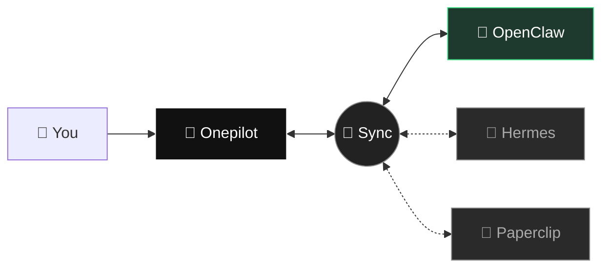
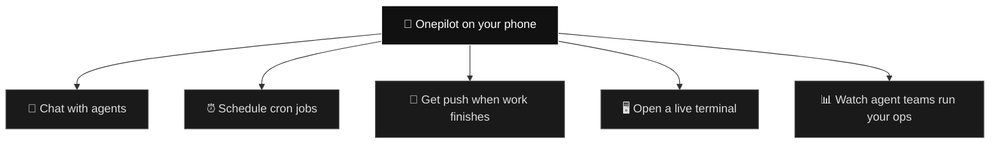

<div align="center">

# Onepilot — AI agents, in your pocket

### Your phone is the remote. Your agents are the work.

[](https://apps.apple.com/)
[](./LICENSE)
[](#license)
[](#supported-frameworks)
[](https://github.com/sofiane8910/onepilotapp/stargazers)

</div>

---

Onepilot is the mobile companion for the AI agents you already run. Cron jobs, chat, deploys, monitoring — all the things your agent does all day, now with a real UI you can open on the bus.

This repo is **the public plugin pool**. Every agent framework we integrate with ships its adapter here, so a user on iPhone can flip from a cron on their OpenClaw agent, to a status board on their Paperclip company, to a persistent-memory chat on Hermes — one app, one surface.

> **Drop-in integration.** If you run an agent framework, you get a free iOS front-end. No SDK to learn, no UI to build.

<br>

## What Onepilot looks like



*Solid line = live. Dashed = next release.*

<br>

## What you can do with it



<br>

## Supported frameworks

| Framework | Plugin | Status | What it adds to Onepilot |
|---|---|---|---|
| [**OpenClaw**](https://github.com/openclaw/openclaw) | [`openclaw/onepilot-channel`](./plugins/openclaw/onepilot-channel) | ✅ **Live** | Chat, cron, multi-agent, push alerts |
| [**Hermes Agent**](https://hermes-agent.nousresearch.com/) | [`hermes/*`](./plugins/hermes) | 🚧 Next | Persistent-memory chat, multi-channel gateway mirror |
| [**Paperclip**](https://github.com/paperclipai/paperclip) | [`paperclip/*`](./plugins/paperclip) | 🚧 Next | Agent-company dashboard, budgets, org chart on mobile |

Want another framework? [Open an issue](https://github.com/sofiane8910/onepilotapp/issues/new).

<br>

## Install Onepilot

**iOS app:** [App Store link](https://apps.apple.com/) *(badge)*

Once the app is installed, it picks up plugins from this repo automatically — no manual tarball downloads, no terminal commands. Pair your agent, and the right plugin gets fetched in the background.

<br>

## Write a plugin

Each plugin lives under `plugins/<framework>/<name>/`. The README inside each folder is the integration guide for that specific framework.

Release flow is git-tag driven:

```sh
# from main, after your plugin is ready to ship
git tag <framework>/<plugin>@v1.2.3
git push origin <framework>/<plugin>@v1.2.3
```

The CI workflow picks up the tag, packs the right subdirectory, and uploads the tarball as a GitHub release asset. Done.

<br>

## Contributing

- **Framework author?** Let's integrate. Open an issue titled `integration: <framework>` and we'll scope a plugin.
- **User?** Star the repo 🌟, report bugs, ask for features.
- **Security?** See [SECURITY.md](./SECURITY.md) *(coming soon)* — responsible disclosure, please.

<br>

## License

- **Plugin adapters in this repo** (everything under `plugins/`, plus `docs/` and the workflow) — [MIT](./LICENSE). Fork them, ship your own, embed them in whatever runtime you want.
- **The Onepilot iOS app** — closed-source, proprietary. The app binary ships through the App Store; its source is not published.

In other words: this repo is the **public adapter layer**. It lets any framework wire into Onepilot without touching the app's code. The app itself stays private.

<br>

<div align="center">
<sub><b>Onepilot</b> · agents on your phone · <a href="https://github.com/sofiane8910/onepilotapp/stargazers">star this repo ⭐</a> if you want more frameworks supported</sub>
</div>
