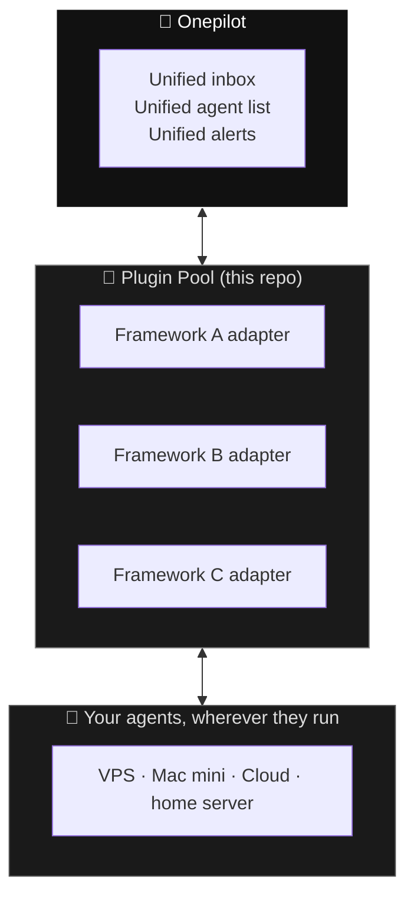

# Vision — where Onepilot is heading

## The one-line pitch

**One phone app. Every agent framework.**

Every serious AI agent framework in 2026 ships the same gap: a server-side runtime with no polished consumer surface. Users glue together terminals, Slack bots, and dashboards. Onepilot closes that gap once, for all of them.

 

## The shape of the product

Three layers. Phone on top, adapters in the middle, agents on the bottom. Users only ever touch the phone.

 

## What makes a framework a fit

We integrate with frameworks that:

1. **Have a programmable extension surface** (plugins, adapters, channels, webhooks — doesn't matter what they call it, as long as we can inject).
2. **Ship under a permissive license** (MIT, Apache-2.0).
3. **Have either real traction or a clear differentiator** — we're not chasing every new agent repo, we're chasing the ones users will actually run.
4. **Expose their state** — messages, tasks, costs, logs, whatever the user wants to see on their phone.

 

## The plugin pool — roadmap

### ✅ Live — OpenClaw

The first integration. OpenClaw is a multi-agent runtime with a clean channel abstraction, so the plugin slots in as "just another channel" alongside Telegram/Slack/CLI. Onepilot becomes the user's primary UI: chat, scheduled jobs, multi-agent fan-out, push alerts on completion.

**Why OpenClaw first:** strong plugin API, active development, exactly the kind of runtime a power user runs on a spare server and then forgets about. A mobile remote is the missing piece.

 

### 🚧 Next — Hermes Agent (Nous Research)

[Hermes Agent](https://hermes-agent.nousresearch.com/) is a self-improving agent with persistent memory, released February 2026 and already past 95K GitHub stars. It has a built-in multi-channel gateway that talks to Telegram, Discord, Slack, WhatsApp, Signal, CLI.

**What the Onepilot plugin will add:** a new channel alongside those, so Hermes users can chat with their persistent-memory agent from iOS — same inbox as their OpenClaw agents. No code changes in Hermes itself, just an adapter.

**Bonus angle:** Hermes's skill-accumulation model (agents that get better from use) pairs well with a mobile UI you actually carry around — every phone interaction becomes training.

 

### 🚧 Next — Paperclip (@dotta)

[Paperclip](https://github.com/paperclipai/paperclip) is an orchestration layer that turns AI agents into a *company* — org charts, budgets, governance, goal tracking. Released March 2026, ~38K stars in four weeks.

**What the Onepilot plugin will add:** the first mobile surface for a Paperclip company. Live agent status cards, today's spend, queued tasks, one-tap approvals — all the things a founder wants to glance at between meetings without opening a laptop.

**Bonus angle:** Paperclip is designed for "zero-human companies" — Onepilot makes it a *one-human, one-phone* company. That reframing is half the pitch.

 

### What comes after

Candidates we're watching — additions driven by user demand, not by us chasing logos:

- Cross-framework: CrewAI, LangGraph, Autogen — if users ask.
- Vertical runtimes: coding agents, browser agents, ops agents — where a mobile UI unlocks new workflows.
- Non-agent but adjacent: anything with a long-running background job and a notification story (CI runs, self-hosted services, scheduled scrapers).

 

## The moat, honestly

It's not the adapters — adapters are easy. The moat is:

1. **The unified inbox.** Plugging three frameworks into three notification apps gives you three notification apps. Plugging three frameworks into Onepilot gives you *one* place to look.
2. **The mobile-first fit.** Every other client is a desktop Slack copy.
3. **The network effect.** More plugins make the app more valuable; a more valuable app attracts more frameworks; loop.

 

## How this repo fits in

- `plugins/<framework>/<name>/` — the adapters themselves. Each one stands alone, ships on its own release cadence, gets consumed by the iOS app at runtime.
- `README.md` — the vitrine. Marketing landing page, plugin catalog, contributor entry point.
- `docs/catalog.json` — machine-readable plugin index for the app and for anyone scripting against the pool.

No app source in here. This repo is purely the plugin pool and the landing page. The iOS app lives on the App Store; its source lives elsewhere.

 

## Anti-goals

Things we are explicitly **not** doing:

- **Not** building a framework of our own. There are already enough.
- **Not** a proprietary API. Users keep running the framework they chose.
- **Not** a router or meta-agent. Each plugin passes through to its own framework — no hidden routing.

 

## Get involved

- **Framework author?** Open an issue titled `integration: <your-framework>`. We'll scope the adapter.
- **User who wishes Onepilot supported X?** Open an issue titled `wish: <X>` and describe what you'd do with it.
- **Plugin author?** Fork, add your subdir under `plugins/<framework>/`, open a PR.

One app. Every framework. Your phone.
